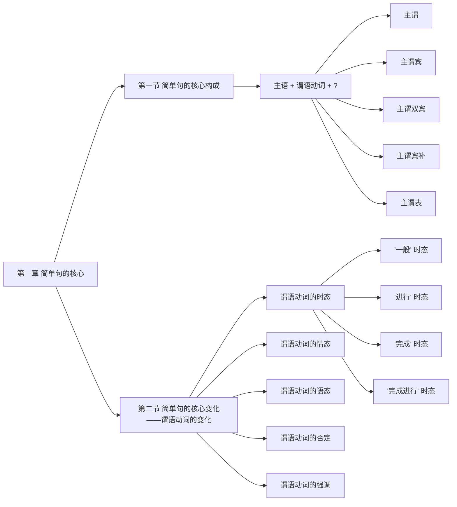

# 简单句的核心

```mermaid
graph LR
    A["第一章 简单句的核心"] --> B["第一节 简单句的核心构成"]
    A --> C["第二节 简单句的核心变化——谓语动词的变化"]

    B --> D["主语 + 谓语动词 + ?"]
    D --> E["主谓"]
    D --> F["主谓宾"]
    D --> G["主谓双宾"]
    D --> H["主谓宾补"]
    D --> I["主谓表"]

    C --> J["谓语动词的时态"]
    J --> K["'一般' 时态"]
    J --> L["'进行' 时态"]
    J --> M["'完成' 时态"]
    J --> N["'完成进行' 时态"]

    C --> O["谓语动词的情态"]
    C --> P["谓语动词的语态"]
    C --> Q["谓语动词的否定"]
    C --> R["谓语动词的强调"]
```
