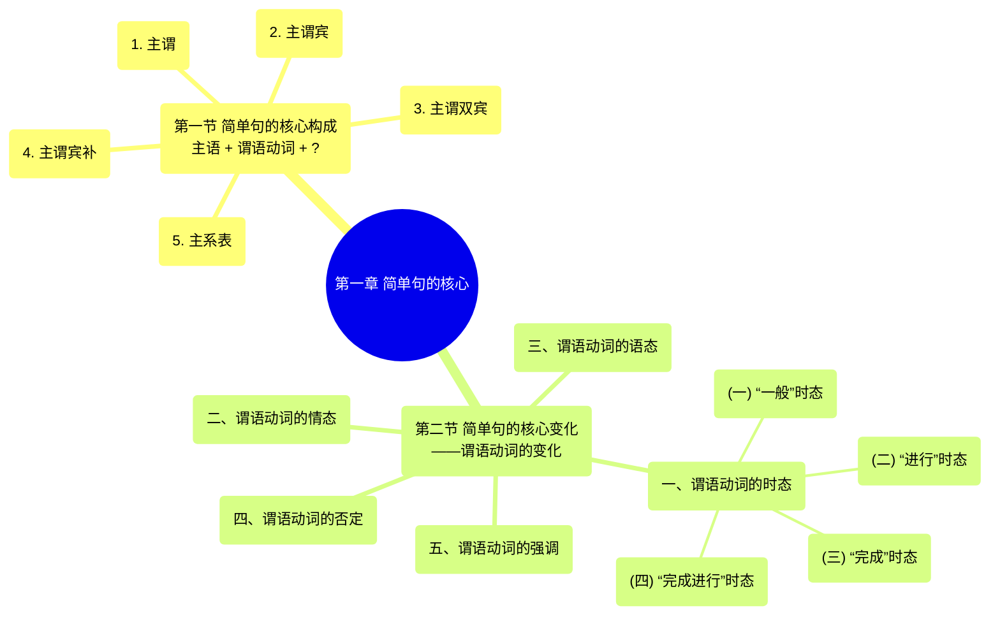

# 简单句的核心

```mermaid
mindmap
  root((第一章 简单句的核心))
    ("第一节 简单句的核心构成<br/>主语 + 谓语动词 + ?")
      ("1. 主谓")
      ("2. 主谓宾")
      ("3. 主谓双宾")
      ("4. 主谓宾补")
      ("5. 主系表")
    ("第二节 简单句的核心变化<br/>——谓语动词的变化")
      ("一、谓语动词的时态")
        ("(一) “一般”时态")
        ("(二) “进行”时态")
        ("(三) “完成”时态")
        ("(四) “完成进行”时态")
      ("二、谓语动词的情态")
      ("三、谓语动词的语态")
      ("四、谓语动词的否定")
      ("五、谓语动词的强调")
```