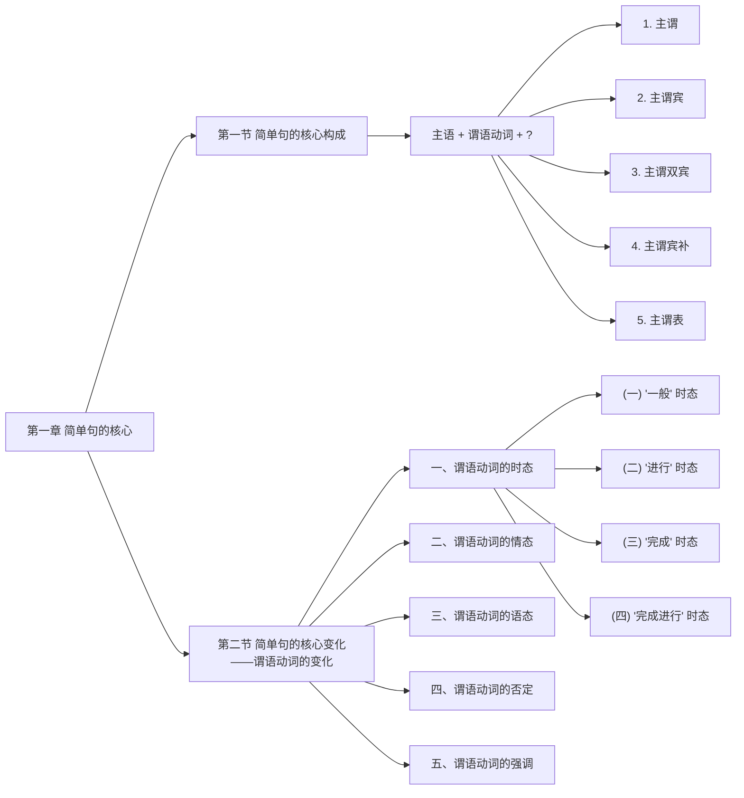

# 简单句的核心

```mermaid
graph LR
    A["第一章 简单句的核心"] --> B["第一节 简单句的核心构成"]
    A --> C["第二节 简单句的核心变化——谓语动词的变化"]

    B --> D["主语 + 谓语动词 + ?"]
    D --> E["1. 主谓"]
    D --> F["2. 主谓宾"]
    D --> G["3. 主谓双宾"]
    D --> H["4. 主谓宾补"]
    D --> I["5. 主谓表"]

    C --> J["一、谓语动词的时态"]
    J --> K["(一) '一般' 时态"]
    J --> L["(二) '进行' 时态"]
    J --> M["(三) '完成' 时态"]
    J --> N["(四) '完成进行' 时态"]

    C --> O["二、谓语动词的情态"]
    C --> P["三、谓语动词的语态"]
    C --> Q["四、谓语动词的否定"]
    C --> R["五、谓语动词的强调"]
```
