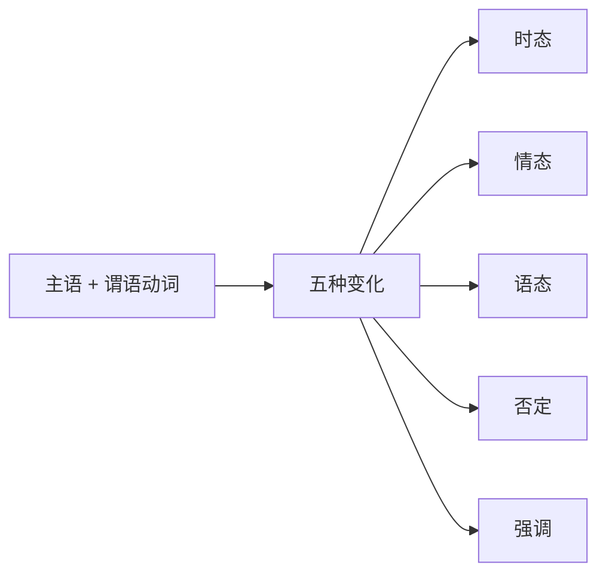

# 简单句的核心变化——谓语动词的变化

简单句中最核心的构成部分就是“一主一谓”，它们可以有多种变化形式，尤其要注意谓语动词的变化。

谓语动词的变化共有五种，其中“强调”出现得比较少，简单了解；而谓语动词的前四种变化“三态加一否”要重点掌握。其中“三态”指的是时态、情态、语态，“一否”指的是否定。谓语动词的这五种变化，无论怎么变，最终都会作为一个整体的谓语动词出现。也就是说，一个简单句中只能有一个谓语动词，但是一个谓语动词不一定是一个单词，有可能是几个单词组成的一个整体，这一点是后续分析考研英语长难句的基础。

## 谓语动词的时态

### What is 谓语动词的时态?

时态是表达事情发生的“时间”和“状态”，通过把谓语动词变成不同的形式来体现。谓语动词的五种变化中，只有时态是每一个谓语动词必有的（因为事情只要发生，就一定发生在一定的时间里并体现一定的状态）。时态一共分为十六种，但是建议不要理解成独立的十六个，而应该将其分成两个维度：一是表达动作发生的“时间”，二是表述动作发生的“状态”。例如，现在进行时：动作发生的时间是现在，动作表述的状态是正在进行。因此时态就可以按照两个维度，划分如下。

- 四种时间：过去、现在、将来、过去将来
- 四种状态：一般、进行、完成、完成进行

四种时间 × 四种状态 = 十六种时态

### How to use 谓语动词的时态?

时间通常是以“现在”为出发点，现在的之前是“过去”，现在的之后是“将来”。唯一比较特别的是“过去将来”，它的出发点不是现在，而是站在过去，看过去的之后将要发生的事情。时间这个维度比较容易理解，相对来说比较难以掌握的是“状态”这个维度。“状态”分为四种：一般、进行、完成、完成进行。接下来详述每一种状态所表达的含义。

#### “一般”时态

“一般”，即不特殊，没有任何的特殊强调，既不强调“进行”，也不强调“完成”，只表达事情发生在这个时间段内。例如：“一般过去时”，表示发生在过去这个时间段内的事情，不强调进行或完成等状态（因为如果强调某一种状态的话，则要换成对应的时态，即过去进行时或过去完成时等）。

::: tip 【补充】
“一般”时态是四种时态中最常用的一种，也是唯一一个没有统一的谓语动词公式的时态，因此需要逐一记住每种“一般”时态所对应的谓语动词形式。
:::

##### 一般过去时: 谓语动词 = did

表示发生在过去的事情（通常表示完全发生在过去的事，即现在已经不再那样）。

- 例: The problem **began** late last year...
  > 译: 这个问题始于去年年底……
  > 此句想表明“这个问题开始”是发生在过去(去年年底)，而且没有强调这个事情正在进行或已经完成，只是表达发生在过去，因此使用一般过去时。
- 注意一般过去时的句子不一定非要搭配明确的过去的时间，只要动作是发生在过去即可。
- 例: This scale **took** numerous factors into consideration.
  > 译: 这个等级量表考虑到了很多因素。
- 例: ...this city **was** one of the largest human settlements in the world.
  > 译: 该城市(过去)是世界上最大的人类居住地之一。
- `settlement` /ˈsetlmənt/ n. 定居；解决

##### 一般现在时: 谓语动词 = do/does

表示发生在现在的事，可以表示现在的状态，也可以表示现在经常性、习惯性发生的事。

- 例: So far the results **are** inconclusive.

  > 译: 迄今为止，这个问题尚无定论(结果是不确定的)。
  > 此句表明“结果是不确定的”，表示现在的状态，因此使用一般现在时。

- 例: The goal **is** new-search, not re-search.

  > 译: (科学研究的)目标是新研究，而不是重复研究。
  > 此句表明“目标是新研究”，表示现在的状态，因此使用一般现在时。注意使用 be 动词的需要根据主语从 am、is、are 中选择一个来表示一般现在时。

- 例: Each year researchers **publish** millions of papers in more than 30,000 journals.

  > 译: 每年，研究人员在 3 万多种期刊上发表数百万篇论文。
  > Each year 表示“每年”，即现在经常性或习惯性发生的事，因此使用一般现在时。

- `journal` /dʒɜːnl/ n. 期刊，杂志，刊物

- 例: Archaeologists commonly **use** computers to map sites and the landscapes around sites.

  > 译: 考古学家通常使用计算机来绘制遗址及其附近的地形图。
  > commonly 表示“通常地，一般地”，即现在经常性或习惯性发生的事，所以用一般现在时。

- `archaeologist` /ˌɑːkiˈɒlədʒɪst/ n. 考古学家
- `landscape` /ˈlændskeɪp/ n. 地图；风景

- 若主语为第三人称单数，则谓语动词要变为第三人称单数形式（be 动词除外），如下。

- 例: Today it **makes** almost no difference.

  > 译: 现今它(体重)基本没有影响了。
  > 由于主语是第三人称单数“it”，所以谓语动词要变为对应的第三人称单数，即把“make”变为“makes”。

- 例: Pearson also **predicts** a breakthrough in computer-human links.

  > 译: 皮尔森还预言，在计算机与人的连接上会有一个重大突破。
  > 主语“Pearson”是一个人的名字，是第三人称单数的主语，所以谓语动词自然要变成第三人称单数“predicts”。

::: tip 【补充】
一般现在时中，谓语动词变为第三人称单数，是为了对应第三人称单数的主语。但第三人称单数的主语除 he、she、it 之外，还有不定代词（如 everyone、something、nobody 等）、不可数名词和可数名词单数（如单个的人名、地名等）。
:::

##### 一般将来时: 谓语动词 = will+do 或 am/is/are going to + do

表示发生在将来的事，注意是“现在的将来”，即现在的之后。

- 例: We **will have** a less civil society.

  > 译: 我们将拥有一个不那么文明的社会。

- `civil` /ˈsɪvl/ adj. 文明的，有教养的；公民的，平民的；民事的，民法的
- `a civil society` 文明社会

- 例: ...the pharmaceutical companies **will scream**.

  > 译: …医药公司将会高声抗议。

- `pharmaceutical` /ˌfɑːməˈsuːtɪkl/ adj. 制药的；配药的

- 例: Who'**s going to pay** for the rest of the bill?

  > 译: 谁来支付其余的费用呢?

- 如果谓语动词是 be 动词，那么放在 will 或 am/is/are going to 后面，且用动词原形 be。

- 例: ...the problems **will be** different.

  > 译: …问题将有所不同。

- 例: Clearly, only the biggest and most flexible television companies **are going to be** able to compete in such a rich and hotly-contested market.

  > 译: 显然，只有最大、最灵活的电视公司才能在如此丰富、竞争激烈的市场上竞争。

- `flexible` /ˈfleksəbl/ adj. 灵活的；柔韧的
- `hotly-contested` 竞争激烈的

::: tip 【补充】
will 和 am/is/are going to 都可以后接动词原形，表示（现在的）将来发生的事，通常可以互换使用。但两者之间其实强调的方面有所不同，“am/is/are going to + do" 通常强调事先有计划或有打算的，或事前有预兆的；而“will + do”强调个人的意愿，表示“将要/愿意做某事”（will 是情态动词）。由于两者本身差别不大，所以通常可互换，而且在考研中不需要掌握区别用法。
:::

##### (一般)过去将来时: 谓语动词 = would+do 或 was/were going to + do

表示事情发生在过去的将来，即“过去的之后”。此时态通常与上下文的一般过去时搭配，表示在其之后发生的事情。

- 例: They **gave** justices permanent positions so they **would be** free to upset those in power...

  > 译: 他们给法官永久职位，因此他们（指法官）就可以自由地推翻当权者……
  > 他们（过去）给法官们永久职位，因此法官们（之后）就可以自由地推翻当权者。此句中两个动作都发生在过去，先发生的“gave”使用了一般过去时，而在其之后发生的自然是“过去的之后”，所以“would be”为过去将来时。

- `upset` /ʌpˈset/ v. 打击；打乱

- 例: ...it simply **didn't foresee** what **would happen** next.

  > 译: ……它只是没有预见接下来会发生什么事情。
  > 它只是（过去）没有预见接下来（过去的之后）会发生什么事情。

- `foresee` /fɔːˈsiː/ v. 预见，预知

- 例: For a while it **looked** as though the making of semiconductors...**was going to be** the next casualty.

  > 译: 一段时间以来，半导体制造业似乎将成为下一个受害者 ……
  > 过去将来时除了用“would+动词原形”之外，还可以用“was/were going to + 动词原形”，如上。

- `semiconductor` /ˌsemikənˈdʌktə(r)/ n. 半导体
- `casualty` /ˈkæʒuəlti/ n. 受害者；伤亡人员

::: tip 【补充】
一般将来时和过去将来时，同样表示将来（之后的事情），差别在于出发点不同，一个是站在“现在”看之后将会发生的事，一个是站在“过去”看之后。因此它们的谓语动词形式大体一致，只要把一般将来时的公式对应地变成过去时，就是过去将来时的公式。
:::

#### “进行”时态

“进行”时态强调在某个时间段内正在进行或持续进行的事情，有统一的谓语动词公式 “**be doing**”（其中 be 可根据所处的时间段不同，而换成不同时态的 be 动词）。

##### 过去进行时: 谓语动词 = was/were + doing

- 例: He **was searching** for tiny engraved seals...

  > 译: 他正在寻找小型刻花印章 …
  > 此句用过去进行时，强调他是“过去正在寻找或持续寻找”小型刻花印章。

- `seal` /siːl/ n. 印章；封条

- 例: Within two weeks, he **was talking** for the first time with the board of Hartford Financial Services Group...

  > 译: 在(离职后)两周内，他就和哈特福德金融服务集团董事进行了第一次交谈……
  > 此句用过去进行时，强调他是在过去的两周内与董事会“正在会谈或持续会谈”。

##### 现在进行时: 谓语动词 = am/is/are + doing

- 例: Home prices **are holding** steady in most regions.

  > 译: 在大多数地区，房屋价格保持稳定。
  > 此句用现在进行时，强调房价是“现在正在保持”稳定。

- `hold steady` 保持稳定
- `steady` /ˈstedi/ adj. 稳定的，不变的

- 例: The astronomy community **is making** compromises to change its use of Mauna Kea.

  > 译: 天文学界正在做出妥协，来改变对莫纳克亚山的使用。
  > 此句用现在进行时，强调天文学界“现在正在做出”妥协。

- `make compromises` 做出让步，妥协
- `compromise` /ˈkɒmprəmaɪz/ n. 妥协，折中；和解

##### 将来进行时: 谓语动词 = will be + doing (其中 be 动词永远用原形 be)

- 例: Now, rivals **will be charging** sales tax...

  > 译: 现在，竞争对手(确定)将要收取销售税……..
  > 将来进行时可以表示将来某时正在进行，也可以表示确定要发生的将来。本句中就是表示“确定将要收取销售税”。

- `rival` /ˈraɪvl/ n. 对手，竞争者

- 这种时态在考研真题中极少出现，考生不必掌握。

#### “完成”时态

“完成”时态是所有时态中最容易被误解的，也是同学们最不敢使用的，同时也是考研真题中经常出现的。之所以会误解“完成”时态，主要是因为同学们对“完成”两个字的含义不清楚。“完成”不代表都做完了，它其实包含了两方面含义：一是“**全部完成**”，即事情都做完了；二是“**部分完成**”，即事情只完成了一部分，而没都做完。很多同学会误解完成时，片面地认为它表示都做完了，而忽略了它的第二种用法。

“完成”时态其实是表达一件事的“完成结果”：有可能“做完了”（全部完成），也有可能“没做完”（部分完成）。但是无论做完与否，这都是一种完成的结果。而“完成”时态的重点是看事情的角度：想要了解一件事的完成结果，就要站在某一个时间点回头看之前，才知道事情完成得怎么样了。因此，“完成”时态的用法为：“**×× 时间的之前**”，一件事的完成结果（可能全部完成，也可能部分完成）。完成时有统一的谓语动词公式“**have done**”（其中 have 可换成不同时态）。

##### 过去完成时: 谓语动词 = had + done

表示“站在过去的时间点回头看之前发生的一件事的完成结果”。事情可能全部完成，也可能部分完成，但完成与否不重要，重要的在于这个时态所强调的角度——“**过去的之前**”。只要是“过去的之前”发生的事情都可以用过去完成时来表达，无论完成的结果如何。

- 例: He **had** never **gambled** before the casino sent him a coupon for $20 worth of gambling.
  > 译: 在赌场送给他一张价值 20 美元的优惠券之前，他从未赌博过。
  > 上句中“赌场寄给他一个优惠券”使用的是一般过去时 sent，即表示过去。句前又加上一个词 before，表示在那之前，即表示过去的之前，所以在“过去的之前”发生的事使用过去完成时 had gambled 来表示。
- `gamble` /ˈɡæmbl/ v. 赌博；冒险
- `coupon` /ˈkuːpɒn/ n. 优惠券；礼票

::: tip 【补充】
使用过去完成时，要满足两大要素——“过去”和“之前”。但并非所有的“过去”都要求在同一个句子中伴随着出现一般过去时，有可能出现在它的上下文中。而“之前”也并非一定要出现 before 之类的表达，含义中隐含也可以。
:::

- 例: The interviewers **had rated** applicants on a scale of one to five.
  > 译: 招生官先是按照 1 到 5 的等级为申请者评级。
  > 上句中没有出现明显的“过去”和“之前”，但已经隐含在其上下文中了。
- `applicant` /ˈæplɪkənt/ n. 申请人

::: tip 【补充】
很多同学认为，一般过去时与过去完成时都表达“过去”的事情，差别就在于一个强调“一般”，一个强调“完成”。其实在应试中，两者的区别可以想得更简单一些。

| 过去完成时=过去的之前 | 一般过去时=过去 |
| :-------------------- | :-------------- |
| 先发生                | 后发生          |

两个时态都表示过去，差别在于先后发生：“过去完成时”发生在先，而“一般过去时”发生在后。了解这个可以帮助同学们更好地理解考研真题上下文。
:::

- 例: ...he **expressed** the opinion that in two or three respects his mind **had changed** during the preceding twenty or thirty years.
  > 译: ……他（指达尔文）在写作中表达了这样一个观点：在之前的二三十年里，他的思想已经在两三个方面发生了变化。
  > 上句中出现了两个事情“他表达了观点”(expressed, 一般过去时)和“他的想法改变了” (had changed, 过去完成时)。尽管连接两个句子时，中间没有使用 before 或 after 这类表达，但可以根据时态判断两件事情的先后，他的想法改变（过去完成时）发生在先，而他表达观点（一般过去时）发生在后。
- `respect` /rɪˈspekt/ n. 方面；尊重
- `preceding` /prɪˈsiːdɪŋ/ adj. 之前的，在先的

::: tip 【补充】
过去完成时表达“过去的之前”，即站在过去回头看之前发生的事，所以涉及了两个时间——“过去”和“过去的之前”。因此过去完成时其实表达的是一个时间段，从“过去的之前”到“过去”。
:::

- 例: Roman Catholicism **had been** the state religion...
  > 译: 罗马天主教过去一直是（西班牙的）国教……
  > 此处使用的是过去完成时，因此表达的是从“过去的之前”到“过去”这一时间段内，罗马天主教一直是国教。
- `Catholicism` /kəˈθɒlɪsɪzəm/ n. 天主教；天主教义

##### 现在完成时: 谓语动词 = have/has + done

表示“站在现在的时间点回头看之前发生的一件事的完成结果”。事情可能全部完成，也可能部分完成，但完成与否不重要。重要的在于这个时态所强调的角度——“**现在的之前**”。只要是“现在的之前”发生的事情都可以用现在完成时来表达，无论完成的结果如何。

现在完成时是考研英语中经常出现的时态，因为人永远活在现在，而站在现在这个角度去回想之前发生的事情，都可以使用现在完成时。

- 例: The question of GDP and its usefulness **has annoyed** policymakers for over half a century.

  > 译: 半个多世纪以来，GDP(国内生产总值)及其有效性的问题一直困扰着政策制定者。

- `annoy` /əˈnɔɪ/ v. 使烦恼；打扰，干扰；使恼怒，使生气

- 例: The ethical judgments of the Supreme Court justices **have become** an important issue recently.

  > 译: 最近，最高法院法官的道德判断已成为一个重要议题。

- `ethical` /ˈeθɪkl/ adj. 道德的；伦理的

::: tip 【补充】
现在完成时表达“现在的之前”，即站在现在回头看之前发生的事，所以涉及两个时间——“现在”和“现在的之前”。因此现在完成时其实表达的是一个时间段，从“现在的之前”到“现在”，即“**从过去到现在**”。
:::

- 例: For the most part, the response **has been** favorable...
  > 译: 大部分人的反应一直是赞同…
  > 此处使用的是现在完成时，因此表达的是“从过去到现在”这一时间段内，反应一直是赞同。
- `response` /rɪˈspɒns/ n. 反应，响应；回答，答复
- `favorable` /ˈfeɪvərəbl/ adj. 赞同的；有利的

::: tip 【补充】
现在完成时表达“现在的之前”这一含义，所以在“have/has”和“done”中间常常夹着一些副词强调“之前”这一含义。例如：already“已经”、just“刚刚”、ever “曾经”、never“从不”。还可以加入其他副词，例如：also“也”、nearly“几乎”、long“长期地”等。
:::

- 例: Most leading retailers **have already tried** e-commerce, with limited success, and expansion abroad.

  > 译: 大多数主要的零售商已经尝试过电子商务，(但)收效甚微，他们也尝试过海外拓展。

- `retailer` /ˈriːteɪlə(r)/ n. 零售商
- `expansion` /ɪkˈspænʃn/ n. 扩展；膨胀

- 例: Scientific publishing **has long been** a licence to print money.

  > 译: 科学出版业长期以来一直是一本万利。

- `scientific publishing` 科学出版业，学术出版
- `a licence to print money` 印钱的许可执照；不费劲赚大钱
- `publishing` /ˈpʌblɪʃɪŋ/ n. 出版业；出版 adj. 出版业的；出版的

- 例: Families **have also experienced** changes these years.

  > 译: 这些年，家庭也经历了变化。

::: details 【补充说明：现在完成时与一般过去时的区别】
从宏观上来讲，两者涉及的时间不同，一般过去时只表示“过去”，而现在完成时表示的是“从过去到现在”这一时间段。例如：

- ...the response **has been** favorable... 表示“从过去到现在”反应一直是赞同的。
- ...the response **was** favorable... 则只表示“过去”反应是赞同的，而“现在”已经不再那样了。

从微观上来讲，可以把现在完成时的两种用法分别跟一般过去时进行比较。
① 现在完成时的“全部完成”VS.一般过去时 (可互换使用，但强调不同)
既然现在全部都完成了，就说明事情发生在过去，因此可以换成一般过去时。但两者表达同一件过去的事情时，强调的角度有所不同。
现在完成时强调站在现在这个角度看过去的事情，虽然事情做完了，但影响持续到现在，通常会在上下文中体现出对现在的影响。例如: He **has left**, so I cannot find him now. 他已经离开了(事情做完了)，所以我现在找不到他，强调对现在有影响。
一般过去时强调站在过去的角度看过去的事，通常会搭配出现过去的时间。例如: He **left** two hours ago. 句中出现了 two hours ago(两个小时前)，强调过去的时间。
② 现在完成时的“部分完成”VS.一般过去时 (不能互换使用)
如果是只做完了一部分，没有全部做完，则说明现在还在做，就不能换成一般过去时。因为一般过去时表示完全发生在过去的事，现在已经不再那样，意思不同，所以不能互换。例如:

- We **have learned** English for 15 years. 我们从过去到现在学了 15 年英语。(现在还在学)
- We **learned** English for 15 years. 我们过去学了 15 年英语。(现在不学了)
  :::

##### 将来完成时: 谓语动词 = will have + done

表示“站在将来的时间点回头看之前发生的一件事的完成结果”。事情可能全部完成，也可能部分完成，但完成与否不重要，重要的在于这个时态所强调的角度——“**将来的之前**”。将来完成时在近 16 年的考题中，只出现了一次，不用重点掌握。

- 例: ...relaxation will be in front of smell-television, and digital age **will have arrived**.
  > 译: ……人们将在气味电视机前休闲娱乐，届时数字化时代也已经来到了。
  > 后半句中用将来完成时 will have arrived，表达“截止到将来那个时候的之前，数字化时代已经来临了”。
- `relaxation` /ˌriːlækˈseɪʃn/ n. 休闲；消遣
- `digital` /ˈdɪdʒɪtl/ adj. 数字的；数码的

::: tip 【补充】
三种“完成”时态可以理解为“阶段性总结”，站在某个时间点回头看之前，总结一下事情完成的结果如何。只不过所处的时间点不同，便换成对应的不同的完成时，并且把公式"have + done”中的 have 换成对应的时态。例如:站在过去总结之前的事情，则使用过去完成时，公式变为“had + done"。
:::

#### “完成进行”时态

顾名思义就是“完成”和“进行”两种时态的结合，即在“完成”时态的基础上又更进一步，强调了“进行”的过程。所以“完成进行”时态的用法为：**×× 时间的之前，强调一件事进行的过程**。

::: tip 【补充】
“进行”的过程又分为三种：还在进行（事情没有全部做完）、持续进行（不间断地进行）、重复进行（一次又一次，断断续续地进行）。但是同学们不需要掌握这三种不同的“进行”，在考研中没必要，只需要记住“完成进行”时态是强调过程的即可。
:::

##### 现在完成进行时: 谓语动词 = have/has been + doing

不必纠结于语法书上写的各种用法，可以从应用的角度更加简单地理解，把相同时间段的“完成时”和“完成进行时”放在一起来看。以“现在完成时”和“现在完成进行时”为例，两者看事情的角度相同（都是站在现在回头看之前的事），但强调的方面不同，比较如下。

|                | 角度相同                   | 强调不同                                      |
| :------------- | :------------------------- | :-------------------------------------------- |
| 两种时态       | 都表示 “现在的之前”        |                                               |
| 现在完成时     | have/has + done            | 现在完成时强调结果(做完与否都可以)            |
|                | We have not won the match. |                                               |
| 现在完成进行时 | have/has been + doing      | 现在完成进行时强调过程                        |
|                |                            | We have been working hard for several months. |

如上两个例句，“我们没有赢得比赛”和“我们努力了好几个月”都是现在的之前发生的事，差别只在于“努力”是强调过程，用现在完成进行时；而“没赢得比赛”是强调结果，用现在完成时。

由此得知：想表达“现在的之前”发生的事情，有两种选择——现在完成时和现在完成进行时，到底用哪一个取决于想强调什么。强调结果，用现在完成时；强调过程，用现在完成进行时。

- 例: That kind of electronic spying **has been going** on for decades.

  > 译: 这种电子间谍活动已经持续了几十年。
  > 根据阅读的上下文得知，这样的电子间谍活动“在现在的之前”已经存在，此处想强调“过程”持续了数十年，因此使用现在完成进行时 has been going on.

- `electronic` /ɪˌlekˈtrɒnɪk/ adj. 电子的
- `spying` /ˈspaɪɪŋ/ n. 间谍活动；侦探

- 例: Big chains **have been collecting** sales tax nationwide...

  > 译: 大型连锁企业一直都在全国范围内收取销售税·
  > 大型连锁企业“现在的之前”就在全国范围内收取销售税，而且想强调“过程”一直持续进行，因此使用现在完成进行时 have been collecting.

- `nationwide` /ˌneɪʃnˈwaɪd/ adv. 在全国 adj. 全国范围内的

##### 过去完成进行时: 谓语动词 = had been + doing

#####将来完成进行时: 谓语动词 = will have been + doing

“完成进行”时态一共有三种：现在完成进行时、过去完成进行时和将来完成进行时。它们的用法都是一样的，都可以和对应时间的完成时来比较使用。但同学们需要掌握的只有现在完成进行时，另外两种在考研真题中没有出现过，不用掌握。

### Why to learn 谓语动词的时态?

谓语动词的时态是每个谓语动词都必然会有的，因为任何的动作或事情都会发生在一定的时间段内并表现出一定的状态。由于时态是谓语动词必备的变化形式，因此要重点掌握。掌握了时态，一是可以帮助我们更加精准地了解事情发生的时间和状态，二是可以帮助解题。在考试真题中常会出现混淆时态（把一个时态故意错误地修改为另一个时态）和今昔对比（拿现在和过去进行对比）的考点，要重点注意区分时态的不同。

### 内容要点

(1) 时态=事情发生的“时间”+“状态”，通过谓语动词的变化来体现。
注意：每一个谓语动词都一定有时态，因此很重要。
(2) 时态共十六种（如下图）：其中有背景色的八种为考研重点，画叉的三种完全不需要会，其余简单了解。
(3) 学习时态要分成两个维度——时间和状态，重点学习“状态”的维度，共分四种：一般、进行、完成、完成进行。
(4) 注意：不管表达时态的谓语动词的单词有几个，都算作一个整体，即一个谓语动词。

**时态的公式**

| 时间   状态                      | 过去                                 | 现在                                      | 将来                                                   | 过去将来                                                   |
| :---------------------------------- | :----------------------------------- | :---------------------------------------- | :----------------------------------------------------- | :--------------------------------------------------------- |
| **一般**                            | 一般过去时   did                  | 一般现在时   do/does                   | 一般将来时   will + do   am/is/are going to + do | 一般过去将来时   would + do   was/were going to + do |
| **进行**   be + doing            | 过去进行时   was/were + doing     | 现在进行时   am/is/are + doing         | 将来进行时   will be + doing                        | X                                                          |
| **完成**   have + done           | 过去完成时   had + done           | 现在完成时   have/has + done           | 将来完成时   will have + done                       | X                                                          |
| **完成进行**   have + been+doing | 过去完成进行时   had been + doing | 现在完成进行时   have/has been + doing | 将来完成进行时   will have been + doing             | X                                                          |

_(表格中 X 表示考研不需要掌握的时态)_

### 真题演练

请用下划线标出谓语动词的部分，并判断谓语动词的时态及时态表达的含义。

::: info 试一试

1.  The use of this little-known practice has accelerated in recent years...
2.  The human nose is an underrated tool.
3.  Readers are migrating away from print anyway.
4.  Amazon.com received one for its "one-click" online payment system.
5.  But what will be the nature of that difference?
6.  Dr. Yehuda notes another difference between the sexes.
7.  ...his explanation was surprisingly straight up.
8.  We will become a second-rate country.
9.  And a significant number of the homeless have serious mental disorders.
10. ...lots of working folks had already seen signs of the slowdown themselves.
11. My wife and I lectured about this looming danger twenty years ago.
12. Americans life expectancy has nearly doubled over the past century.
13. A team of researchers... would submit the results of their research to a journal.
14. Foreign-made cars and textiles were sweeping into the domestic market.
15. In recent years, railroads have been combining with each other...
16. By 1830 the former Spanish and Portuguese colonies had become independent nations.
17. A good innovational thinker is always exploring the many other possibilities.
18. This tendency in the natural sciences has long been evident in the social sciences too.

:::

::: details 答案解析

1.  The use of this little-known practice **has accelerated** in recent years...
    > 译: 近年来，这种少有人知的做法已被加快推行……
    > 时态为现在完成时，表示现在的之前（从过去到现在）已经发生的动作。
2.  The human nose **is** an underrated tool.
    > 译: 人类的鼻子是一个被低估的工具。
    > 时态为一般现在时，表示现在的客观状态。
3.  Readers **are migrating** away from print anyway.
    > 译: 无论如何，读者正在远离纸质版(报纸)。
    > 时态为现在进行时，表示现在正在进行的动作。
4.  Amazon.com **received** one for its "one-click" online payment system.
    > 译: 亚马逊公司的“一键式”在线支付系统获得了一项(专利)。
    > 时态为一般过去时，表示过去的动作。
5.  But what **will be** the nature of that difference?
    > 译: 但是那种不同的本质会是什么呢?
    > 时态为一般将来时，表示将来的状态。
6.  Dr. Yehuda **notes** another difference between the sexes.
    > 译: 耶胡达博士注意到了两性之间的另一个差异。
    > 时态为一般现在时，表示现在的动作。
7.  ...his explanation **was** surprisingly straight up.
    > 译: ……他的解释出乎意料地直率坦白。
    > 时态为一般过去时，表示过去的状态。
8.  We **will become** a second-rate country.
    > 译: 我们将变成一个二流国家。
    > 时态为一般将来时，表示将来的状态。
9.  And a significant number of the homeless **have** serious mental disorders.
    > 译: 并且相当数量的无家可归者患有严重的精神疾病。
    > 时态为一般现在时，表示现在的状态。
10. ...lots of working folks **had** already **seen** signs of the slowdown themselves.
    > 译: …许多上班族自己就已经看到了(经济)减速的迹象。
    > 时态为过去完成时，表示过去的之前已经发生的事情。
11. My wife and I **lectured** about this looming danger twenty years ago.
    > 译: 我和妻子曾在 20 年前，就这一正在逼近的危险发表过演讲。
    > 时态为一般过去时，表示过去的动作。
12. Americans' life expectancy **has** nearly **doubled** over the past century.
    > 译: 在过去的一个世纪里，美国人的预期寿命几乎延长了一倍。
    > 时态为现在完成时，表示现在的之前（从过去到现在）已经发生的动作。
13. A team of researchers... **would submit** the results of their research to a journal.
    > 译: 一组研究人员……将会把他们研究的结果递交给一家期刊。
    > 时态为过去将来时，表示过去某个时间点之后将要发生的动作。
14. Foreign-made cars and textiles **were sweeping** into the domestic market.
    > 译: 外国制造的汽车和纺织品正涌入(美国)国内市场。
    > 时态为过去进行时，表示过去正在进行或持续进行的动作。
15. In recent years, railroads **have been combining** with each other...
    > 译: 近年来，铁路公司一直在相互联合……
    > 时态为现在完成进行时，表示现在的之前（从过去到现在）已经发生的事情，并且强调过程的持续。
16. By 1830 the former Spanish and Portuguese colonies **had become** independent nations.
    > 译: 截止到 1830 年，西班牙和葡萄牙的前殖民地已经成为独立的国家。
    > 时态为过去完成时，表示过去的之前已经发生的事情。
17. A good innovational thinker is always **exploring** the many other possibilities.
    > 译: 一个优秀的、创新型的思考者总是在探索许多其他的可能性。
    > 时态为现在进行时，表示现在正在进行或持续进行的动作。
18. This tendency in the natural sciences **has** long **been** evident in the social sciences too.
    > 译: 自然科学领域的这一趋势长期以来在社会科学领域也很明显。
    > 时态为现在完成时，表示现在的之前（从过去到现在）一直持续的状态。

:::

::: tip 考场攻略
谓语动词的时态建议重点掌握，不仅帮助准确理解句意，还可以帮助解题。

时态是每个句子中每个谓语动词必然会有的形式，所以一定要重点掌握，才能准确地看懂每件事所发生的时间和状态。例如：
I love you.

I loved you.
同样表示“我爱你”，但是由于时态不同，意思完全不一样。"I love you.”是一般现在时，表示“我现在爱你”。而“I loved you.”是一般过去时，表示“我过去爱你 (现在不爱了)”。如上可见，理解时态对于准确理解句意是多么重要。

在考研阅读中，会出现专门针对时态设置的“混淆时间/混淆时态”的错误选项，例如 2008 年阅读 Text 3 第 34 题中，原文中表述的是“has not changed”，现在完成时，表示“现在的之前没有改变”；而错误选项中故意写成了“will remain unchanged",一般将来时，表示“将来保持着不会改变”，虽然都是“不改变”，但选项与原文在时态上明显不符，这就是错误选项的出题套路——故意“混淆时间/混淆时态”。

当然，以下这个选项中不只出现了时态这一处错误，还有“偷换概念”的另一处错误，原文中说的是“the length of military uniforms(军装的长度)”，而错误选项中故意写成了"the design of military uniforms(军装的样式)”。

:::

## 谓语动词的情态

### What is 谓语动词的情态?

情态，顾名思义就是表示“情绪和态度”。针对不同的事情要表达不同的情绪和态度，需要在谓语动词前加上不同的情态动词。不同于时态和语态的变化（把谓语动词的形式进行改变），情态的变化是保持谓语动词不变（用动词原形），在它前面加上一个情态动词。
考研中常出现的情态动词如下。

| 现在时 | 过去时 |
| :----- | :----- |
| must   | ——     |
| can    | could  |
| will   | would  |
| shall  | should |
| may    | might  |

### How to use 谓语动词的情态?

情态动词的使用，有如下特点。

- 情态动词后要接动词原形。若谓语动词是 be 动词，就用“情态动词+be”。

- 情态动词一般只有现在和过去两种时态，可以成对地来记，例如 can 是现在时，而 could 是它对应的过去时。上表中只有 must 没有过去时。

::: tip 注意

could/would/should/might 这四个词有两种用法，除表示相应的过去时之外，还可以表示现在的一种更委婉和客气的语气。例如：Can you help me now?与 Could you help me now? 同样表示“你可以帮我吗”，同样表示现在，只不过 could 比 can 在语气上更委婉客气。

:::

- 情态动词没有人称的变化，也就是说无论主语是谁，情态动词永远用原形，即没有第三人称单数形式。

- 情态动词变否定，直接在情态动词后加 not；变疑问，直接把情态动词提到主语前。

#### 情态动词表示“情态”

| 情态动词   | 含义与用法                      | 真题例句                                                                  | 翻译                                          |
| ---------- | ------------------------------- | ------------------------------------------------------------------------- | --------------------------------------------- |
| must       | 必须（表强烈义务或肯定推测）    | ...we **must** also **act** with caution.                                 | ...我们也必须谨慎行事。                       |
|            |                                 | Human drivers sometimes **must make** split-second decisions.             | 人类驾驶员有时候必须在一瞬间做出决定。        |
| can/could  | 能够/可以（表能力或可能性）     | ...the right mental workouts **can significantly improve** our cognition. | ...适当的大脑训练能够显著改善我们的认知功能。 |
|            |                                 | **Could** a hug a day **keep** the doctor away?                           | 每天一个拥抱可以让我们远离医生吗？            |
| will/would | 愿意/将要（表意愿或将来时态）   | **Will** you **marry** me?                                                | 你愿意嫁给我吗？                              |
|            |                                 | The first draft **will appear** on the page...                            | 初稿将会跃然纸上...                           |
|            |                                 | Potential home buyers **would cheer** for lower interest rates.           | 潜在的房产买家将会因低利率而欢呼。            |
| may/might  | 可以/可能（表许可或较弱可能性） | Expressions **may influence** emotions...                                 | 表情可能会影响情绪...                         |
|            |                                 | Such bodily reaction **might help** moderate stress effects.              | 这种身体反应很可能有助于缓解压力影响。        |
| should     | 应该（表建议或义务）            | America **should follow**.                                                | 美国应该效仿。                                |
|            |                                 | Those with persistent nightmares **should seek** help.                    | 长期受噩梦困扰者应该寻求专业帮助。            |
|            |

- `split-second` 一瞬间做出的
- `significantly` /sɪɡˈnɪfɪkəntli/ adv. 较大地；重要地
- `potential` /pəˈtenʃl/ adj. 潜在的，可能的 n. 潜力，可能性
- `interest rate` 利率
- `conceivably` /kənˈsiːvəbli/ adv. 可想象地；可相信地
- `psychological` /ˌsaɪkəˈlɒdʒɪkl/ adj. 心理(学)的；精神上的
- `moderate` /ˈmɒdərət/ v. 使...缓和；使...缓解
- `persistent` /pəˈsɪstənt/ adj. 持续不断的；坚持不懈的
- `therapist` /ˈθerəpɪst/ n. 治疗专家，临床医学家
- `nightmare` /ˈnaɪtmeə(r)/ n. 噩梦

#### 情态动词表示“推测”

除表示“情绪和态度”之外，每一个情态动词都能表示推测。其中推测的可能性最高的为 must，表示“肯定，一定”；可能性最低的为 can't/couldn't，表示“不可能”；其他表示推测的，皆可理解为“可能，也许”。

- 例: The details **may be** unknowable...

  > 译: 细节可能是不可知的...…

- 例: Such searches **can take** years.

  > 译: 这样的搜寻可能要花费数年的时间。

- 例: It **might be** poetic, philosophical, sensual, or mathematical, but in any case it **must**...**have** something to do with the soul of the human being.

  > 译: 它可能是诗情画意的，蕴含哲理的，愉悦感官的，也可能是理性的，但无论如何它一定...与人类的灵魂有关。

- `poetic` /pəʊˈetɪk/ adj. 富有诗意的；诗人的
- `philosophical` /ˌfɪləˈsɒfɪkl/ adj. 哲学的；达观的
- `sensual` /ˈsenʃuəl/ adj. 世俗的；感官的
- `mathematical` /ˌmæθəˈmætɪkl/ adj. 精确的；数学的

- 例: ...this loss of mental focus **can potentially have** a damaging impact on our professional, social, and personal wellbeing.

  > 译: ...这种精神集中的丧失可能会对我们的职业、社会和个人幸福产生破坏性的影响。

- `potentially` /pəˈtenʃəli/ adv. 可能地；潜在地
- `professional` /prəˈfeʃənl/ adj. 职业的；专业的

::: tip 【补充】

除“情态动词+do”之外，还有一些变体的结构，如下:

- “情态动词 + have done”表示“针对之前的事情表达情态或推测”。

- “情态动词 + be doing”表示“针对正在进行的事情表达情态或推测”。

这种变体的用法简单了解含义即可，出现得不多。
:::

- 例: ...the peculiar way of conducting the experiments **may have led** to misleading interpretations of what happened.

  > 译: ...进行实验的特殊方式可能导致了（实验者）对所发生事件的误导性解释。

- `misleading` /mɪsˈliːdɪŋ/ adj. 令人误解的
- `interpretation` /ɪnˌtɜːprɪˈteɪʃn/ n. 解释；阐释

- 例: ...the community **should be grasping** the opportunity to raise its influence in the real world.

  > 译: ...社科界此时应该紧抓这个机会来提高其在现实世界的影响力。

- 例: Now something similar **could be happening** in the oceans.
  > 译: 现在，类似的事情可能正发生在海洋中。

::: tip 【补充】
除以上的情态动词之外，还有一些常用的情态动词词组，能够辨认并了解含义即可。例如：have to（不得不，必须）， ought to（应该）等。
:::

- 例: They **have to be** careful not to come across as disappointed in their child.

  > 译: 他们必须小心，不要表现出对孩子感到失望。

- 例: ...public-health advocates **ought to take** a page from advertisers...
  > 译: 公共健康倡导者们应该借鉴广告人士的做法...。
- `advocate` /ˈædvəkət/ n. 提倡者，拥护者 /ˈædvəkeɪt/ v. 提倡，拥护

::: tip 【补充】
情态动词还可以用于虚拟，稍后会在第二部分第三章第一节中详细展开讲解。
:::

### Why to learn 谓语动词的情态?

情态动词在考研真题中通常不会作为单独的知识点进行考查，所以大家要能做到：

- 结合上下文，看懂情态动词在句中表达的“情态”或“推测”的含义即可。

- 情态还会结合时态、被动语态和否定，构成一个整体的谓语动词。能够准确找到这个谓语动词的整体对于后续分析长难句很有帮助。

### 内容要点

- 情态动词的用法主要有两种:
  一是表达“情绪和态度”；二是表达“推测”。

- 考研常用的情态动词：must, can, could, will, would, should, may, might.

- 注意：“情态动词 + 动词原形”算作一个整体，即一个谓语动词。

### 真题演练

请用下划线标出谓语动词的部分，并找到情态动词，写出含义。

::: info 试一试

1. Online education can supplement the traditional kind.
2. ...the new nations should be sovereign and independent states...
3. He must store a large quantity of grain instead of consuming all his grain immediately.
4. This could add value to their businesses in three ways.
5. Upcoming reforms might bring the price to a more reasonable level.
6. Employers wouldn't mind a little fewer bubbles in the job market.
7. ...but we cannot escape the context of our unique life experience.
8. ...we must press forward on deeper atmospheric and oceanic research.
9. In such a case, the company's response may not be sufficiently quick or thoughtful...
10. Your outline should smoothly conduct you from one point to the next...
11. Moreover, the integration of the European community will oblige television companies to cooperate more closely in terms of both production and distribution.
12. ...this very difficulty may have had the compensating advantage of forcing him to think long and intently about every sentence...

:::

::: details 答案解析

1. Online education **can supplement** the traditional kind.

   > 译: 在线教育可以补充传统教育。
   > 情态动词 can 表示情态，“可以”。

2. ...the new nations **should be** sovereign and independent states...

   > 译: ...新的国家应该是独立自主的国家...
   > 情态动词 should 表示情态，“应该”。

3. He **must store** a large quantity of grain instead of consuming all his grain immediately.

   > 译: 他必须储存大量粮食而不是立即消耗完所有粮食。
   > 情态动词 must 表示情态，“必须”。

4. This **could add** value to their businesses in three ways.

   > 译: 这可以从三个方面为他们的商业增加价值。
   > 情态动词 could 表示情态，“可以”。

5. Upcoming reforms **might bring** the price to a more reasonable level.

   > 译: 即将进行的改革可能会使价格降至更合理的水平。
   > 情态动词 might 表示猜测，“可能”。

6. Employers **wouldn't mind** a little fewer bubbles in the job market.

   > 译: 雇主将不会介意就业市场少些泡沫。
   > 情态动词 would 表示情态，“将要”，此处出现的是否定形式 wouldn't，表示“将不会”。

7. ...but we **cannot escape** the context of our unique life experience.

   > 译: ...但我们无法摆脱我们独特的生活阅历背景。
   > 情态动词 can 表示情态，“能够”，此处出现的是否定形式 cannot，表示“不能”。

8. ...we **must press** forward on deeper atmospheric and oceanic research.

   > 译: ...我们必须向前推进对于大气和海洋的更深入的研究。
   > 情态动词 must 表示情态，“必须”。

9. In such a case, the company's response **may not be** sufficiently quick or thoughtful...

   > 译: 在这种情况下，企业的回应可能不够迅速或不周到...
   > 情态动词 may 表示猜测，“可能”，此处出现的是否定形式 may not，表示“可能不”。

10. Your outline **should smoothly conduct** you from one point to the next...

    > 译: 你的提纲应该引导你从一个要点流畅地过渡到下一个（要点）...…
    > 情态动词 should 表示情态，“应该”。

11. Moreover, the integration of the European community **will oblige** television companies to cooperate more closely in terms of both production and distribution.

    > 译: 此外，欧洲社会的一体化将迫使电视公司在制作和发行方面更密切地合作。
    > 情态动词 will 表示情态，“将要”，用于构成一般将来时。

12. ...this very difficulty **may have had** the compensating advantage of forcing him to think long and intently about every sentence...
    > 译: ...或许正因为（语言表达上的）这种困难，他不得不对自己要说的每句话都经过长时间的认真思考...结果这反而（已经）成为他的优点。
    > 情态动词 may 表示猜测,"may have +过去分词”表示推测过去，“或许已经”。

:::
