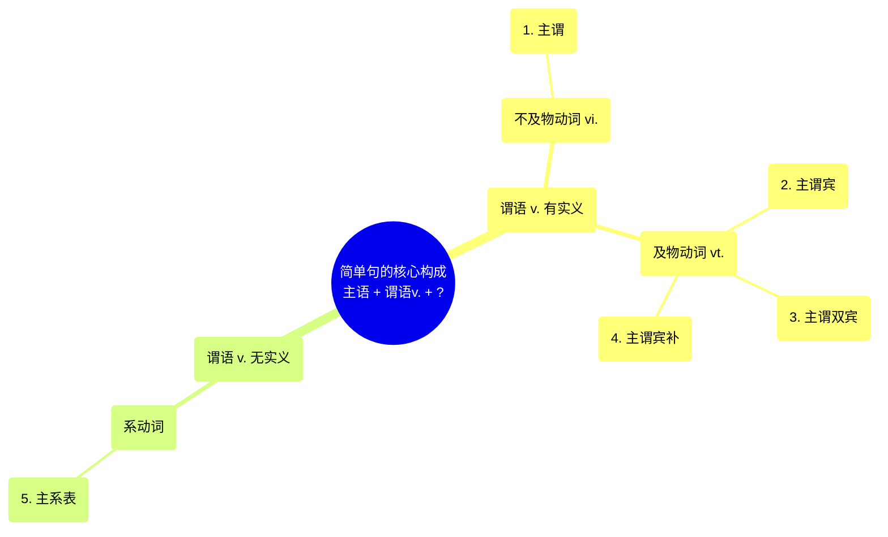

# 简单句的核心构成

::: tip
核心公式：主语 + 谓语动词 + ?
:::

### What is 简单句? 简单句的核心构成?

想表达清楚一件事，写成一个简单句，就需要连词成句。而一件事最核心的两个构成部分就是“物质”和“运动”（马克思主义哲学中指出“世界是物质的，物质是运动的”，因此有了物质和运动就可以把一件事描述清楚），所以简单句的核心就是“名词”和“动词”。

其中，名词作主语（表述的对象），动词作谓语（表述的内容）。由于简单句描述的是一件事，所以其核心构成就是“**一主一谓，一一搭配**”（谓语动词不能多，也不能少）。

### How to use 简单句的核心构成?

谓语动词作为简单句的核心，它的不同就决定了简单句的不同，因此简单句可以再细分成五类不同的核心构成：**主谓、主谓宾、主谓双宾、主谓宾补、主系表**。

谓语动词主要分成两大类：**实义动词**和**非实义动词**。

- **实义动词**：指谓语动词有实在的动作含义，例如：`swim`、`dance`对应着动作“游泳”和“跳舞”。
- **非实义动词**：指谓语动词没有实在的动作含义，例如：`be`、`seem` 不对应任何的动作。

实义动词可再细分成两类：**及物动词 (vt.)** 和 **不及物动词 (vi.)**。
通常会认为它们的区别在于是否后接宾语，但是及物动词和不及物动词最根本的区别在于这个动作是否可以由主语独立完成。

- 所谓“**及物**”，即“涉及别的物”，也就是主语不能自己独立完成这个动作，后面需要加上动作涉及的物（动词的宾语）。
- 所谓“**不及物**”，即“不涉及别的物”，也就是主语能自己独立完成这个动作，后面不需要加上任何对象，即不接宾语。

根据谓语动词的不同分类，简单句细分如下。

---

##### 1. 主谓 = 主语 + 不及物动词 (vi.)

- 例: `Everybody else loses.`

  > 译: 其他人都输了。
  > 谓语动词 `loses`，表示“失败”，指主语自己失败，动作不涉及别的物，即不及物动词，则不需要后接宾语，主谓两部分就可以构成完整的简单句。

- 例: `Smaller species survived.`
  > 译: 较小的物种幸存下来了。
  > 谓语动词 `survived`，表示“幸存，活下来”，指主语自己活下来（独立完成的动作），不及物动词，因此该句是主谓结构的简单句。
  - `species` /ˈspiːʃiːz/ n. 物种，种类
  - `survive` /səˈvaɪv/ v. 幸存、存活；继续存在

---

##### 2. 主谓宾 = 主语 + 及物动词 (vt.) + 宾语

- 例: `Everybody loves a fat pay rise.`

  > 译: 人人都喜欢丰厚的加薪。
  > 谓语动词 `loves`，表示“爱，喜欢”，后面需要接“爱谁”或“爱什么”，及物动词。因为动作涉及别的物，则需要把涉及的对象（动词的宾语）接在后面，主谓宾三部分才能构成完整的简单句。

  - `a fat pay rise` 丰厚的加薪

- 例: `Such debates reflect fierce discussions across the US...`

  > 译: 这些辩论反映出美国各地的激烈探讨……
  > 谓语动词 `reflect`，表示“反映”，后面需要接“反映什么”，及物动词，因此该句是主谓宾结构的简单句。

  - `fierce` /fɪəs/ adj. 猛烈的、强烈的；凶残的，恶劣的

- 图例: `Yet science has a cultural history, too...`

  > 译: 然而，科学也有文化史……
  > 谓语动词`has`，表示“有”，后面需要接“有什么”，及物动词，此句为主谓宾结构的简单句。

- 例: `Several of his staff members have military-intelligence backgrounds.`

  > 译: 他的几位工作人员都有军事情报工作背景。
  > 谓语动词 `have`，表示“有”，用法同上句，此句也为主谓宾结构的简单句。

  - `staff member` 工作人员
  - `military-intelligence background` 军事情报工作背景

  ::: details 【补充】
  对比上面两个例句，可以发现：从表面上来看，句子的内容、长度和难度大不相同。但是从本质上来讲，结构是完全相同的，同样是“主谓宾”结构的简单句，只不过换成了不同的单词组成。因此，只要大家掌握了句子的核心构成，就能发现无论组成句子的单词如何变化，结构都是万变不离其宗的。
  :::

---

##### 3. 主谓双宾 = 主语 + 及物动词 (vt.) + 两个宾语 (人 + 物)

及物动词有时要涉及两个对象，就需要后接两个宾语（通常双宾语是“人+物”）。其中的“人”也可以是类似于人物的对象，例如某个组织或机构。

- 例: `They gave justices permanent positions...`

  > 译: 他们给法官永久职位……
  > 谓语动词 `gave`，表示“给予”，及物动词。它涉及两个对象，一是法官，二是永久的职位，因此后接了两个宾语，构成了主谓双宾结构的简单句。

  - `permanent` /ˈpɜːmənənt/ adj. 永久的

- 例: `...railroads charged all customers the same average rate...`

  > 译: ……铁路公司收取所有客户相同的平均费率……
  > 谓语动词 `charged`，表示“收取”，及物动词。它涉及两个对象，一是所有顾客，二是同样的平均费率，因此后接两个宾语，构成了主谓双宾结构的简单句。

  ::: details 【补充说明：双宾语顺序】
  主谓双宾结构中，由于有两个宾语（人+物），且这两个宾语的前后顺序是可以调换的，既可以是“人+物”，也可以是“物+人”，因此主谓双宾结构的句子有两种写法，且表意相同。

  例:

  - `They gave justices permanent positions...` (`+人+物`)
  - `They gave permanent positions **to** justices...` (`+物+介词+人`)

  在“物+人”的情况下，中间要加入介词，通常为`to`或者`for`。`to` 强调动作的方向，`for` 强调动作的目的。例如：`I bought you a present.` = `I bought a present **for** you.` “我给你买了一个礼物。”其中“给你”表示的是买礼物的目的，因此用介词 `for`。
  :::

  ::: details 【补充说明：直接与间接宾语】
  主谓双宾结构中，无论两个宾语“人+物”哪个位于前面，“物”永远是直接宾语，“人”永远是间接宾语，因为动作一定是直接作用在“物”上面，间接传递给“人”。但是这个不重要，在考研英语中不需要掌握。
  :::

---

##### 4. 主谓宾补 = 主语 + 及物动词 (vt.) + 宾语 + 宾语的补足语 (简称宾补)

有时“主谓宾”结构完整了，但是意思还有所残缺，就需要加入补充的成分。

- 例: `You always keep your eyes open...`

  > 译: 你要时刻留意……
  > "You always keep your eyes...", 如果只写到这, 给人感觉话还没有说完, 没说清楚“保持你的眼睛怎么样”, 因此要加上补充说明的内容 “open”, 把句意补充完整, 就构成了主谓宾补结构的简单句。

- 例: `The spooks call it "open source intelligence,"...`

  > 译: 间谍们称它为“开源情报”……
  > "The spooks call it”, 表示“间谍们称它”, 但没有说清楚“称它什么”, 因此要加上补充说明的内容——"open source intelligence”（公开来源的情报), 补全句意, 就构成了主谓宾补结构的简单句。

  - `spook` /spuːk/ n. 间谍，行踪秘密的人；幽灵
  - `intelligence` /ɪnˈtelɪdʒəns/ n. 情报，消息；智力，智慧

- 例: `...changes in the economy... make gainful employment increasingly difficult...`

  > 译: ……经济方面的变化……使得(年轻人)找到薪水丰厚的工作越来越困难 ……
  > "changes in the economy... make gainful employment”, 如果只写到这, 给人感觉话还没有说全, 要说完整“使(make)就业怎么样”, 因此要加上“difficult”, 补全句意, 构成主谓宾补结构的简单句。

  - `increasingly` /ɪnˈkriːsɪŋli/ adv. 日益，越来越多地

  ::: details 【补充说明：宾补与宾语的关系】
  宾补是用来补充说明宾语的，因此它与宾语有逻辑上的主谓关系，简单来说就是在宾语和宾补的内容中间加上中文“是”，构成完整的句意。如上面的例子：“`You always keep your eyes open...`”，其中宾语 `your eyes` 和宾补 `open` 的关系为“`your eyes` 是 `open`", 即“你的眼睛是睁开的”。
  可以作宾补的词有形容词、名词（或词组）、介词短语、`doing` 或 `to do`等。但在考研英语中，宾补不重要，只要能够看懂它是补充说明宾语的即可。
  :::

---

##### 5. 主系表 = 主语 + 系动词 + 表语

有些句子的句意中，没有实在的动作含义出现（即没有实义动词），但是没有动词又不能构成句子（简单句中必须要具备一个谓语动词），因此需要加入一类特殊的动词 —— 虽然无实义，但是可以把句子前后“连系”起来——这类动词简称“**系动词**”。

> 这是一个危险的游戏。
> This \_\_\_ a dangerous game.

其中谓语动词的部分“是”，很明显无实义，但是必须要加入动词才能前后“连系”起来，构成完整的句子，因此就加入了最常用的一种系动词 `be`动词，来表示“是”这一含义。

- 例: `This is a dangerous game...`

考研真题中常出现的系动词，总结如下：

| 系动词类别          | 常用词                                                | 含义                                         | 真题例句                                                                                                                                                                                                                                                                                      |
| :------------------ | :---------------------------------------------------- | :------------------------------------------- | :-------------------------------------------------------------------------------------------------------------------------------------------------------------------------------------------------------------------------------------------------------------------------------------------- |
| **状态系动词**      | **be** (单独出现,无其他 实义动词)                     | 是                                           | 例: `Trust is a tricky business.`   译: 信任是一件复杂的事情。   例: `...many discussions are not so successful.`   译: ……许多讨论并不是这么成功……                                                                                                                                   |
| **变化系动词**      | **get**, **become**, **turn**, **go**, **grow**       | 变得,成为                                    | 例: `...their behaviour became markedly different.`   译: ……他们的行为就变得明显不同了。   例: `This courageous attitude in fact becomes a requirement for the performers of Beethoven's music.`   译: 这种勇敢的态度实际上成为贝多芬音乐演奏者的一项条件。                          |
| **感官系动词**      | **look**, **sound**, **smell**, **taste**, **feel**   | 看/听/闻/尝/ 感觉起来……                      | 例: `They look cute.`   译: 它们看起来很可爱。   例: `And most folks still feel pretty comfortable about their ability...`   译: 而且大多数人仍然觉得非常满足的是，他们有能力……                                                                                                      |
| **表象/持续系动词** | **seem**, **appear**, **keep**, **remain**, **prove** | 看起来/好像是   保持……   证明,显示出…… | 例: `The prospect seems remote.`   译: 前景似乎非常渺茫。   例: `Nonetheless, unification of sorts remains a major goal.`   译: 尽管如此，某种统一依然是主要的目标。   例: `... the retreat from predominance proved painful.`  译: ……这种领先地位的衰落证明是令人感到痛苦的。 |

- `tricky` /ˈtrɪki/ adj. 复杂的，微妙的，需谨慎对待的
- `markedly` /ˈmɑːkɪdli/ adv. 显著地；引人注目地
- `requirement` /rɪˈkwaɪəmənt/ n. 必要条件；要求
- `pretty` /ˈprɪti/ adv. 非常，相当地 adj. 漂亮的
- `feel comfortable about...` 对……感到满足、舒服
- `prospect` /ˈprɒspekt/ n. 前景，成功机会；希望，可能性；景色，景象
- `remote` /rɪˈməʊt/ adj. 渺茫的；遥远的
- `nonetheless` /ˌnʌnðəˈles/ adv. 尽管如此
- `flourish` /ˈflʌrɪʃ/ v. 繁荣；昌盛

::: details 【补充说明：系动词的判断】
以上表格中四类动词出现时，不一定是系动词。必须在表示相应的含义时才是系动词。

- 如果句子中出现`be`动词，它不一定是系动词，必须是**单独出现**的，即句中无其他实义动词。
  - 例: `The social sciences are flourishing.`
    > 译: 社会科学正在迅猛发展。
    > 上句中虽然有 `be`动词 (`are`)，但此处有实义动词 `flourish`，`be`动词只是帮助实义动词构成现在进行时，所以此处的`be`动词是**助动词**，而不是系动词，此句也不是主系表结构。
- 如果句中有 `get`, `become`, `turn`, `go`, `grow` 这些词出现，不一定是系动词。必须要表达“**变得，成为**”这一含义，才是系动词。
- 如果句中有 `look`, `sound`, `smell`, `taste`, `feel` 这些感官动词出现，也不一定是系动词。必须要表达“**看/听/闻/尝/感觉起来……**”的含义，才是系动词。
  :::

---

### Why to learn 简单句的核心构成?

简单句的核心构成建议了解，但**不要纠结**。

学习了简单句的五类核心构成，很多人都会纠结于是不是要把看到的每一个句子都仔细分析一下。其实真的没必要。因为句子构成（语法）是一个系统化的完整的体系，但其中有些内容只是需要简单了解，打好基础，为以后的内容做好铺垫的。

例如本节内容（通过谓语动词的不同来决定简单句五类不同的核心构成）最主要的目的有两点：

1.  了解原来不同的句子是这样构成的。
2.  为后续学习从句做准备（谓语动词的不同决定了后接从句的不同，例如及物动词后接宾语从句，而系动词后接表语从句）。

---

### 内容要点

简单句的核心构成是五类：**主谓，主谓宾，主谓双宾，主谓宾补，主系表**。

其中“主语+谓语”是每个简单句必备的两部分，而“宾语、表语、补语”则看谓语动词的种类和句意来决定是否需要。

### 真题演练

请用下划线标出谓语动词的部分，并判断谓语动词的种类及简单句的种类。

::: info 试一试
1.  `These views of arguments also undermine reason.`
2.  `More apparent reasonableness followed.`
3.  `...even the word "habit" carries a negative implication.`
4.  `The humiliation continues.`
5.  `...they suddenly became extinct.`
6.  `...poetry of many kinds gave him great pleasure.`
7.  `...our president calls himself "the Decider".`
8.  `The computer is the 21st century's culture machine.`
9.  `Such characteristics make them perfect candidates...`
10. `Such advances offer the aging population a quality of life...`
:::

::: details 答案解析

1.  `These views of arguments also undermine reason.`

    > 译: 这些关于争论的观点也会破坏理性。
    > 谓语动词为实义动词的**及物动词**，表示“破坏”，简单句为**主谓宾**结构。

2.  `More apparent reasonableness followed.`

    > 译: 更明显的合理性随之而来。
    > 谓语动词为实义动词的**不及物动词**，表示“跟随，随之而来”，简单句为**主谓**结构。

3.  `...even the word "habit" carries a negative implication.`

    > 译: ……甚至“习惯”这个词都带有负面含义。
    > 谓语动词为实义动词的**及物动词**，表示“携带，带有”，简单句为**主谓宾**结构。

4.  `The humiliation continues.`

    > 译: 这种屈辱还在继续。
    > 谓语动词为实义动词的**不及物动词**，表示“继续”，简单句为**主谓**结构。

5.  `...they suddenly became extinct.`

    > 译: ……它们突然灭绝了。
    > 谓语动词为**系动词**，表示“变得”，简单句为**主系表**结构。

6.  `...poetry of many kinds gave him great pleasure.`

    > 译: ……各种诗歌带给了他很大的快乐。
    > 谓语动词为实义动词的**及物动词**，表示“给”，后面同时接人和物两个宾语，简单句为**主谓双宾**结构。

7.  `...our president calls himself "the Decider".`

    > 译: ……我们的总统称他自己为“决策者”。
    > 谓语动词为实义动词的**及物动词**，表示“叫作，称作”，“称他自己什么”后面接了补充说明的部分，简单句为**主谓宾补**结构。

8.  `The computer is the 21st century's culture machine.`

    > 译: 计算机是 21 世纪的文化机器。
    > 谓语动词为**系动词**，表示“是”，简单句为**主系表**结构。

9.  `Such characteristics make them perfect candidates...`

    > 译: 这些特性使它们成为理想的研究对象……
    > 谓语动词为实义动词的**及物动词**，表示“使得”，“使得它们怎么样”后面接了补充说明的部分，简单句为**主谓宾补**结构。

10. `Such advances offer the aging population a quality of life...` > 译: 这些进步为老龄人口带来高质量的生活……
    谓语动词为实义动词的**及物动词**，表示“给……提供，为……带来”，后面同时接人和物两个宾语，简单句为**主谓双宾**结构。
    :::

